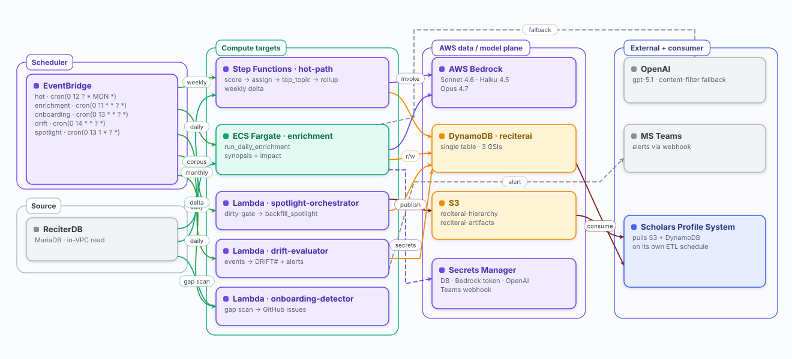

# ReciterAI

Standalone service that produces the canonical research-domain hierarchy, publication scores, faculty rollups, and spotlight artifacts consumed by the [Scholars Profile System](https://github.com/wcmc-its/Scholars-Profile-System).

## What it does

| Pipeline | Output | Where it goes |
|---|---|---|
| `generate_taxonomy.py` | Axis 1 taxonomy: ~67 inductive domain topics (`taxonomy_v2.json`) | Local file; consumed by scoring + subtopic pipelines |
| `score_publications.py` | Per-publication topic vectors (Haiku screening + Sonnet dense scoring via AWS Bedrock) | DynamoDB |
| `discover_subtopics.py` + `assign_subtopics.py` | Axis 1.5 subtopics (~8–15 per topic) and per-publication assignments | DynamoDB + S3 hierarchy artifact |
| `aggregate_subtopic_scores.py` + `rollup_by_cwid.py` | CWID-level faculty profiles (topic + subtopic rollups) | DynamoDB |
| `spotlight/` + `backfill_spotlight.py` | Curated per-faculty spotlight content (LLM-synthesized lede + supporting publications) | S3 artifact + DynamoDB |
| Hierarchy publish | Canonical hierarchy + JSON Schema + manifest, versioned + `latest/` | `s3://wcmc-reciterai-hierarchy` |

## Two-channel publishing

- **S3 — `wcmc-reciterai-hierarchy/`** — canonical hierarchy contract (versioned + `latest/`), JSON Schema co-published. SPS ETL (`etl/hierarchy/index.ts`) reads `latest/manifest.json`, short-circuits on unchanged sha256, otherwise validates against the schema and upserts ~2,010 subtopic rows.
- **S3 — `wcmc-reciterai-artifacts/`** — spotlight artifacts (versioned + `latest/`).
- **DynamoDB** — publication scores, topic assignments, faculty rollups, spotlight records. SPS ETL (`etl/dynamodb/`, `etl/spotlight/`) reads on a schedule into its Prisma/MySQL layer.

## How SPS consumes this

ReciterAI is **upstream**; SPS is downstream. SPS runs its own ETLs to pull from S3 + DynamoDB into its application database. ReciterAI does not call SPS, does not depend on SPS at runtime, and ships independently. Contract source-of-truth lives in [`docs/hierarchy-contract.md`](docs/hierarchy-contract.md) and [`docs/spotlight-contract.md`](docs/spotlight-contract.md) in this repo.

## Architecture

Seven version-controlled diagrams, generated from plain-data specs by a dependency-free SVG toolkit in [`scripts/diagrams/`](scripts/diagrams/). Regenerate with `node scripts/diagrams/build.mjs`; the full gallery (zoomable, ⌘P → PDF) is [`docs/architecture/index.html`](docs/architecture/index.html).

**① System context** — what feeds ReciterAI and who consumes it.

**② Processing pipeline** — the seven stages from corpus to artifact, and the model each calls.

**③ AWS runtime topology** — how it's scheduled and deployed.

**④ Publish contract** — the one-way hand-off to the Scholars Profile System.

**⑤ Functional overview** — a plain-English picture of what ReciterAI does, framed by the question each step answers.

**⑥ Technical stack** — the technology layers, from the Python application code down to the data plane and dev tooling.

**⑦ Stability & drift** — the run-to-run dynamics: what jiggles, what damps it, and the watchdogs that measure residual drift.

> The diagrams are the picture, not the source of truth — edit the specs in [`scripts/diagrams/`](scripts/diagrams/README.md) and rebuild. The SVGs above are committed and render inline on GitHub; PNGs are gitignored and regenerable.

## Documentation

- [GETTING_STARTED.md](GETTING_STARTED.md) — local setup, env vars, running each pipeline
- [ARCHITECTURE.md](ARCHITECTURE.md) — data flow, axes, publishing channels
- [docs/architecture/](docs/architecture/index.html) — rendered architecture diagrams (system context, processing pipeline, AWS topology, publish contract, functional overview, technical stack, stability & drift); regenerate with `node scripts/diagrams/build.mjs`, edit via [`scripts/diagrams/`](scripts/diagrams/README.md)
- [docs/RECITERAI-SPEC.md](docs/RECITERAI-SPEC.md) — architectural decisions and execution status (read this before picking up any architectural work)
- [docs/stage-records-and-gates.md](docs/stage-records-and-gates.md) — Phase 9 substrate guide for new stage authors
- [docs/taxonomy-methodology.md](docs/taxonomy-methodology.md) — design principles for the Axis 1 taxonomy
- [docs/topic-subtopic-assignment.md](docs/topic-subtopic-assignment.md) — mechanics of how publications get labeled
- [docs/hierarchy-contract.md](docs/hierarchy-contract.md) — S3 hierarchy artifact consumer contract
- [docs/spotlight-contract.md](docs/spotlight-contract.md) — spotlight artifact contract
- [docs/data-model-and-queries.md](docs/data-model-and-queries.md) — DynamoDB schema reference
- [docs/daily-enrichment.md](docs/daily-enrichment.md) — operator guide for the daily synopsis+impact job (#37); manually run from the operator's laptop pending org-managed OpenAI key
- [.planning/](\.planning) — phase-by-phase design history (offline pipeline, subtopic system, hierarchy publishing, spotlight pipeline)

## Models (pinned)

| Use | Model | Why |
|---|---|---|
| Screening (recall-first) | `us.anthropic.claude-haiku-4-5-20251001-v1:0` via Bedrock | Cheap (~$0.0005/activity), wide net |
| Dense scoring + synthesis | `us.anthropic.claude-sonnet-4-6` via Bedrock | Calibrated scores, narrative quality |
| Lede generation | `us.anthropic.claude-opus-4-7` via Bedrock | Highest fidelity for spotlight openers |

Model IDs are pinned in [`utils/bedrock_client.py`](utils/bedrock_client.py) (`HAIKU_MODEL` / `SONNET_MODEL` / `OPUS_MODEL`), keyed per pipeline stage in `MODEL_IDS_BY_STAGE`. When Bedrock content-filters a synopsis/impact call, the daily-enrichment job falls back to OpenAI `gpt-5.1` via [`utils/openai_client.py`](utils/openai_client.py).

## Related repos

- [ReciterAI-POC](https://github.com/wcmc-its/ReCiterAI-POC) — original Python pipeline POC. Superseded.
- ReciterAI-Chatbot (local-only, paused) — chatbot iteration that informed this service. Not pushed.
- [Scholars-Profile-System](https://github.com/wcmc-its/Scholars-Profile-System) — downstream consumer.
- [ReCiter](https://github.com/wcmc-its/ReCiter) — author-name disambiguation engine (upstream data source via ReciterDB).
