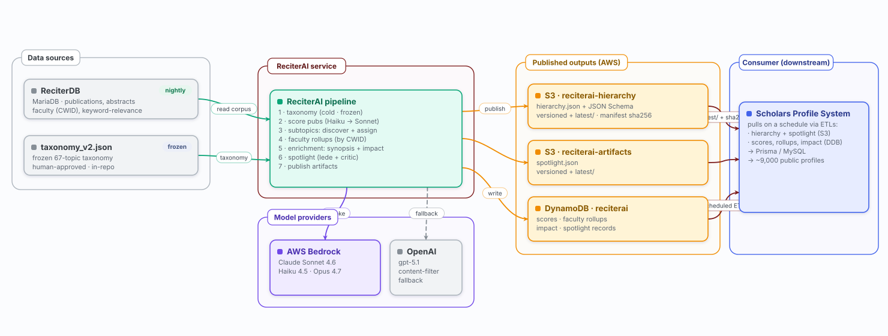

# Architecture diagrams

Data-driven, version-controlled architecture diagrams for **ReciterAI**. Each
diagram is a small **data file**; a shared, dependency-free renderer turns it into
a polished SVG, a PNG, and a combined HTML viewer.

```
node scripts/diagrams/build.mjs        # build everything → docs/architecture/
```

(ReciterAI is a Python service, so there's no `npm` step — the renderer is plain
Node, no packages to install. PNGs use `rsvg-convert` if present, otherwise the
`sharp` npm package; if neither is installed the SVGs/HTML still build and only the
PNG step is skipped.)

Outputs:

| File | Tracked? | Use |
|---|---|---|
| `docs/architecture/index.html` | yes | the viewer — open in a browser; ⌘P → Save as PDF for slides |
| `docs/architecture/<id>.svg` | yes | one standalone vector per diagram (crisp at any zoom; renders on GitHub) |
| `docs/architecture/<id>.png` | no — `*.png` is gitignored | rasterized for slides/Slack/tickets that won't render SVG; regenerate by re-running the build |

## What it produces

Each definition file renders to a standalone SVG. This is the live output of `definitions/01-system-context.mjs`:



All four views in one scrollable, print-to-PDF page: [`../../docs/architecture/index.html`](../../docs/architecture/index.html).

## Layout

```
scripts/diagrams/
  lib.mjs              # the renderer: palettes, anchors, renderSVG(), validate(). Pure — no DOM, no Node APIs.
  definitions/         # one file per diagram = the source of truth (plain data)
    01-system-context.mjs       # sources → ReciterAI → S3 + DynamoDB → Scholars Profile System
    02-processing-pipeline.mjs  # taxonomy → scoring → subtopics → rollups → spotlight → publish
    03-aws-topology.mjs         # EventBridge → Fargate → Bedrock + DynamoDB + S3 (+ OpenAI fallback)
    04-publish-contract.mjs     # two-channel S3 (versioned + latest/, JSON Schema, sha256) + DynamoDB hand-off
  build.mjs            # validate → SVG → PNG → index.html (auto-runs verify-facts.mjs if present)
  check-crossings.mjs  # dev linter: flags edges that tunnel THROUGH a foreign node box
  verify-facts.mjs     # project-specific: asserts diagram constants still match the real sources
  README.md            # this file (per-repo usage)
  PLAYBOOK.md          # portable method for reproducing this in any project
```

## A complete example

Every diagram is one self-contained data file — no partial snippets, this is a *whole* one. Drop it in as `definitions/99-scoring.mjs`, run the build, and you get `docs/architecture/scoring.svg` (then delete it — it's just to see the loop work):

```js
import { A } from "../lib.mjs";   // A() anchors an edge to a box side: "t" "b" "l" "r"

// Boxes. x/y/w/h are literal coordinates in the viewBox below — what you type is where it lands.
const nodes = {
  score: { x: 120, y: 110, w: 300, h: 72, kind: "app",
           title: "score_publications.py", sub: ["Haiku screen → Sonnet score"],
           chip: { tone: "weekly", text: "weekly" } },          // optional status pill
  ddb:   { x: 120, y: 300, w: 300, h: 72, kind: "data",
           title: "DynamoDB · reciterai", sub: ["TOPIC# rows"] },
};

// Optional labelled container band drawn behind the boxes.
const groups = [{ x: 90, y: 80, w: 360, h: 320, kind: "app", title: "Scoring", fo: 0.06 }];

// One arrow: bottom of `score` → top of `ddb`.
const edges = [{ p0: A(nodes.score, "b"), p1: A(nodes.ddb, "t"), color: "amber", label: "write scores" }];

export const spec = { id: "scoring", vb: [540, 440], groups, nodes, edges };

export const meta = {
  nav: "Scoring", kicker: "example", heading: "Scoring", dot: "#0ca678",
  blurb: "score_publications writes TOPIC# rows to DynamoDB.",
  legend: [
    { fill: "#e3faf3", stroke: "#0ca678", label: "Compute" },
    { fill: "#fff4d6", stroke: "#f08c00", label: "Store" },
  ],
  source: "score_publications.py · utils/dynamodb_helpers.py",
};
```

```
node scripts/diagrams/build.mjs    # → docs/architecture/scoring.svg + .png, added to index.html
```

The four real files in `definitions/` are the fuller worked examples: read `01-system-context.mjs` first, then `03-aws-topology.mjs` for hand-routed edges (`points:`), an edge legend, and cadence chips.

## Spec reference

- **Coordinates** are plain numbers in the `vb` (viewBox) space — no layout engine,
  so what you type is where it lands. The build fails if any two nodes overlap or
  anything falls outside the viewBox, so you get told immediately.
- **`kind`** picks the colour (`ext`, `edge`, `net`, `app`, `data`, `aws`, `good`,
  `open`) — see `KIND` in `lib.mjs`.
- **`chip: { tone, text }`** adds a right-aligned status pill (e.g. run cadence) —
  tones in `CHIP`. **`badge`** adds a top accent stripe — see `STACKC`.
- **`A(node, side, f)`** anchors an edge to a node side (`t`/`b`/`l`/`r`), `f` in
  `[0,1]` sliding along that side. Edges auto-curve; pass `points: [{x,y},…]` to
  hand-route around obstacles, `dash: true` for a dashed line, `lp: {x,y}` to place
  a stubborn label.
- **`meta.edgeLegend`** = `[{ color, dash?, label }]` renders a key of arrow
  swatches under the diagram, so edge-colour semantics are a visible legend rather
  than buried in prose. **`meta.seeAlso`** = `[{ id, label }]` adds cross-links to
  the other views (the views deliberately repeat boxes; these connect them).

## Accessibility & metadata

`build.mjs` and `lib.mjs` emit these automatically — no per-diagram work:

- Each `<svg>` gets `role="img"` + `<title>`/`<desc>` (from the view's heading +
  blurb) wired with `aria-labelledby`, so a screen reader announces the diagram.
  Every node and group also carries a `<title>` — which doubles as a **native
  hover tooltip**.
- The gallery `<head>` carries a `meta description` + Open Graph tags, so the page
  unfurls with a title + summary when pasted into Slack/Teams. (`og:image` is
  omitted until there's a canonical hosted URL — relative image paths don't
  unfurl.)
- The footer stamps the **git commit SHA + its date** (not a wall-clock time, so
  no-op rebuilds don't churn the file), telling every reader how fresh the
  picture is. Degrades silently outside a git checkout.

## Adding a diagram

Drop a new `definitions/NN-name.mjs` exporting `{ spec, meta }`. `build.mjs` picks
up every file automatically (ordered by filename) and adds it to the viewer.

## Verify in four tiers

`validate()` (run by the build) only catches node overlaps + out-of-bounds. That's
necessary, not sufficient:

1. **Build-time `validate()`** — overlaps / bounds. Free; gates the build's exit code.
2. **`node scripts/diagrams/check-crossings.mjs`** — flags edges whose path tunnels
   *through* a foreign node box (the class `validate()` is blind to).
3. **`node scripts/diagrams/verify-facts.mjs`** — asserts the constants baked into
   the diagrams (cron strings, model versions, bucket + table names) still match
   their real sources. Runs automatically inside the build too.
4. **Look at the rendered PNG / `index.html`.** Always — no automated check catches
   a label on a line or a confusing-but-legal route.

## Notes

- The renderer (`lib.mjs`) began as a verbatim copy of the Scholars Profile
  System's diagram toolkit and has since **diverged** (accessibility emission,
  provenance footer, edge-legend + see-also support). If you improve the renderer,
  consider porting the change back to the SPS copy.
- `validate(spec)` is exported from `lib.mjs`, so the same geometry checks can run
  in a test or a CI gate.
- Diagram **content** is sourced from `README.md`, `ARCHITECTURE.md`,
  `docs/RECITERAI-SPEC.md`, and the contract docs (`docs/hierarchy-contract.md`,
  `docs/spotlight-contract.md`) — keep those authoritative; these files are the
  picture, not the source of truth.
